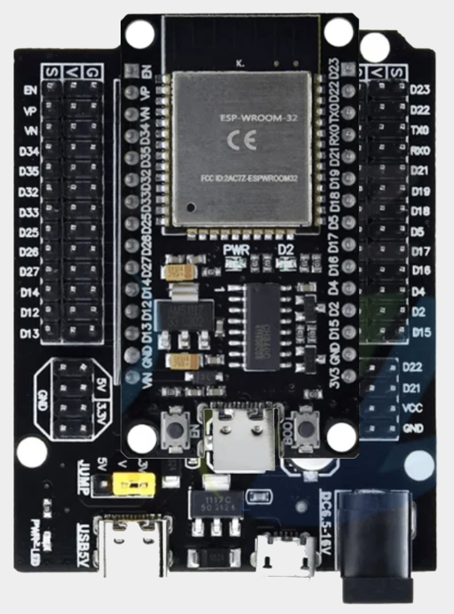
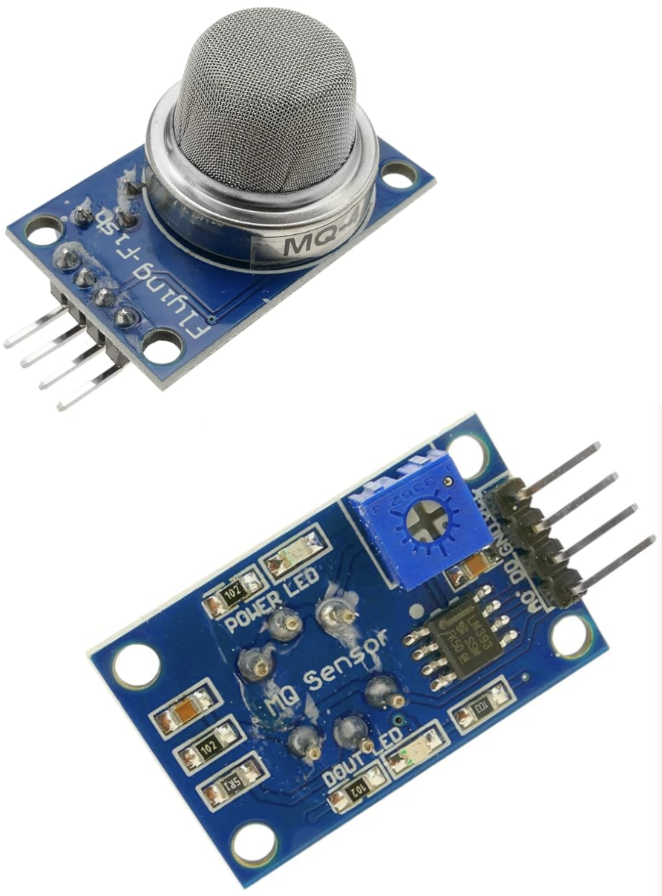
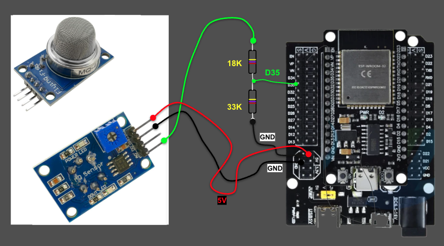
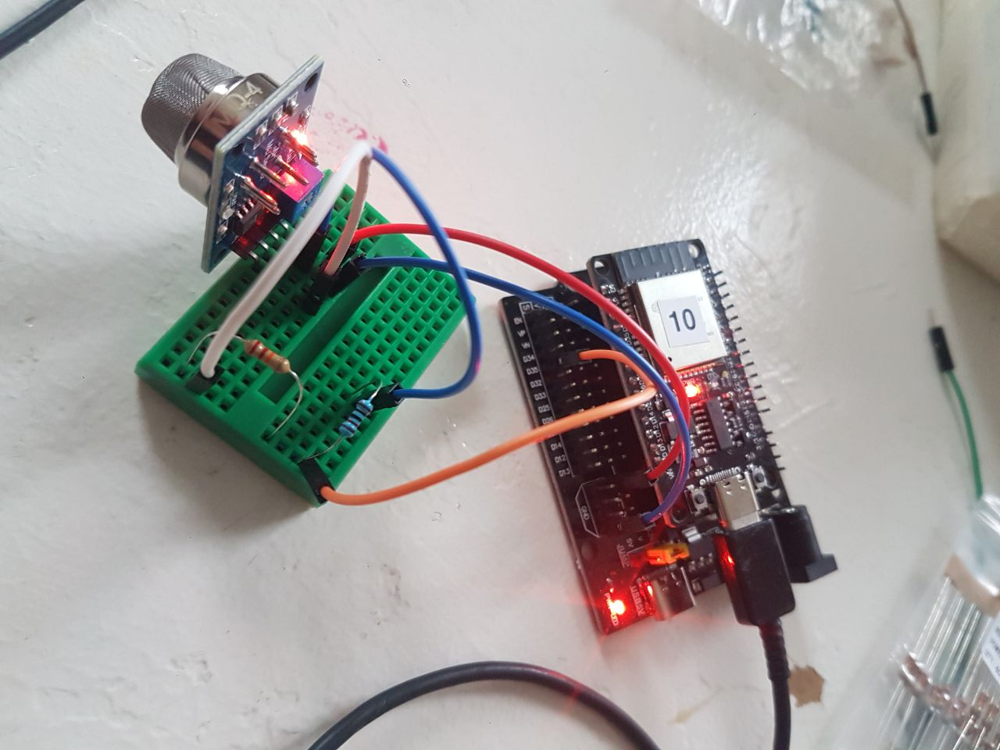
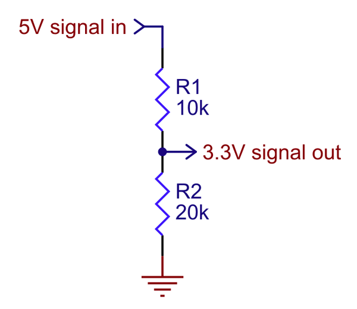

<!-- ## SOLARPUNKLAB - OSR -->

<!-- PROJECT LOGO -->

 

 

<!-- TABLE OF CONTENTS -->

  
<b>CONTENTS</b>

  <ul>
	<li><a href="#about">ABOUT O.S.R.   </a></li>
	<li> <b>LEVEL 1</b></li> <ul>
	<li><a href="#physical">Physical Computing</a></li>
	<li><a href="#mcu">MCU vs Mini-Computer</a></li>
	<li><a href="#sensors"> Sensors and Actuators</a></li>
	<li><a href="#gpio"> GPIO - General Pupose Input Output</a></li>
	<li><a href="#mq4"> MQ4 - Methane gas sensor module</a></li>
	<li><a href="#DS18D20"> DS18D20 Temperature sensor</a></li>
	<li><a href="#bme280"> BMP / BME280 I2C SENSOR</a></li>
  </ul>
     
   <li><b> GENERAL</b> </li>
   <ul>
   		<li><a href="#arduino"> ARDUINO INSTALL</a> </li>
	   <li><a href="code/"> CODE</a> </li>
	   <li><a href="#contact"> CONTACT</a> </li>
  
  </ul>

  
   

<!-- >>>>>> TABLE <<<<< -->
<table width = 90%>
<tr>
<td align = "justify" width = 90% colspan=2>

<b>ABOUT O.S.R.</b>
  
Open Sensor Research is a project by 
<a href="http://solarpunklab.org">SOLARPUNK LAB</a> / 
<a href="http://hackteria.org">HACKTERIA</a> 
aimed at promoting DIY practices to use sensors and microcontrollers for eco -oriented projects. 
  
The documentation offered in this repository is mainly used as support for a series of workshops to introduce newbies as well as specialists and researchers to Physical Computing and DIY environmental monitoring.   
</tr>
</table>
 
 
 

<!-- >>>>>> TABLE <<<<< -->
<table width = 90%>
<tr>
<td align = "justify" width = 90% colspan=2>

 
The term <b>Physical Computing</b> defines, in a broad sense, a field of studies and practices aimed at building interactive physical systems.
 
To this end, technologies are adopted based on integrated software and hardware devices capable of sensing and responding to stimuli coming from the surrounding world.

  

 

<b>MCU vs MiniComputer</b>
 

 
</tr>
</table>

<!-- >>>>>> TABLE <<<<< -->
<table width = 90%>
<tr>
<td align="center" colspan=1 width = 20%>
</td>
<td align="justify" colspan=1 >
The microcontroller (MCU) is a device generally used in integrated systems to carry out specific digital control applications.
 
It is a real microprocessor, that is, a small computer capable of processing information coming from both digital interfaces and analog inputs (for example sensors) and responding with output signals to analog actuators or other digital interfaces, including WiFi communications and Bluetooth.

</tr>
</table>

<!-- >>>>>> TABLE <<<<< -->
<table width = 90%>
<tr>
<td align="center" colspan=2 width = 90% >

 

</tr>
</table>

<!-- >>>>>> TABLE <<<<< -->
<table width = 90%>
<tr>
<td align="center" colspan=2 width = 90% >

<b>SENSORS AND ACTUATORS </b>
  
A SENSOR is a device that measures changes in a certain environment and responds with a signal to another system.
  
Both sensors and actuators are <b>transducers</b>, that is, devices capable of converting one physical quantity into another or one form of energy into another different form,
 
While sensors transform any physical quantities into electrical signals, ACTUATORS transform electrical signals into other appropriate physical quantities.
 
Motors, LED lights, solenoid valves are all examples of actuators that can be controlled by microcontrollers to perform actions in the real world.
  

 

 Examples of SENSORS
  

 

 Examples of ACTUATORS
  

 

  

</tr>
</table>

<!-- >>>>>> TABLE <<<<< -->
<table width = 90%>
<tr>
<td align="left" colspan=2 width = 90% >

<b> GPIO - General Purpose Input / Output</b>
  
The GPIO is a hardware computer interface, available on microcontrollers and microcomputers, that allows you to interact with other peripherals, both analogue and digital.
 
A series of pins on the microcontroller board allow you to connect to the functions implemented by this interface within the chip / microprocessor.
 
Each microcontroller has its own specific set of GPIOs with specific functions, often called "pinout".
  

 

 

 
</tr>
</table>

<!-- >>>>>> TABLE <<<<< -->
<table width = 90%>
<tr>
<td align="center" colspan=2 width = 90% >

 

 

 

 

 

 

 

 

 
<!-- made with https://ezgif.com/video-to-gif -->

   

<a href="https://ohmslawcalculator.com/voltage-divider-calculator">online voltage divider calculator</a>
 

 
<a href="code/OSR_MQ_SENSOR/OSR_MQ_SENSOR.ino">OSR_MQ_SENSOR.ino</a>
  

 
<a href="https://github.com/e-tinkers/esp32-adc-calibrate">https://github.com/e-tinkers/esp32-adc-calibrate</A>
  
</tr>
</table>

<!-- >>>>>> TABLE <<<<< -->
<table width = 90%>
<tr>
<td align="center" colspan=2 width = 90%>

 

 

 
<a href="code/OSR_DS18D20/OSR_DS18D20.ino">OSR_DS18D20.ino</a>
  
</tr>
</table>

<!-- >>>>>> TABLE <<<<< -->
<table width = 90%>
<tr>
<td align="justify" colspan=2 id="bme280" width = 90% >
 

 

 
 
BOSCH's BMP280 is an absolute barometric pressure sensor especially designed for mobile applications. The sensor module is housed in an extremely compact package. Its small dimensions and its low power consumption allow for the implementation in battery powered devices such as mobile phones, GPS modules, or watches. 
 

 
 

  
<a href="https://montreal.weatherstats.ca/charts/pressure_sea-hourly.html" target="pressure"> Barometric pressure at sea evel / Montreal</a>

  

 

 
<a href="code/OSR_BMP280/OSR_BMP280.ino">OSR_BMP280.ino</a>
  
</tr>
</table>

<!-- >>>>>> TABLE <<<<< -->
<table width = 90%>
<tr>
<td align="center" colspan=2 id="arduino" width = 90% >
 

 

 
<a href="https://www.silabs.com/developers/usb-to-uart-bridge-vcp-drivers?tab=downloads">DOWNLOAD ESP32 DRIVERS</a>
  

 
<a href="https://www.arduino.cc/en/software">ARDUINO IDE DOWNLOAD + INSTALL</a>
  

<a href="https://support.arduino.cc/hc/en-us/articles/360016495679-Fix-port-access-on-Linux"> linux problem with USB port access </a>

  

  
in "Addtional boards manager URLs"  
COPY / PASTE the text below 

</tr>
</table>

<!-- >>>>>> TABLE <<<<< -->
<table width = 90%>
<tr bgcolor=#009900>
<td align="left" colspan=2 id="URLS" width = 90%>
https://dl.espressif.com/dl/package_esp32_index.json,
http://arduino.esp8266.com/stable/package_esp8266com_index.json,
https://github.com/stm32duino/BoardManagerFiles/raw/main/package_stmicroelectronics_index.json,
https://m5stack.oss-cn-shenzhen.aliyuncs.com/resource/arduino/package_m5stack_index.json,h
https://raw.githubusercontent.com/damellis/attiny/ide-1.6.x-boards-manager/package_damellis_attiny_index.json,
https://raw.githubusercontent.com/stm32duino/BoardManagerFiles/master/STM32/package_stm_index.json
</tr>
</table>

<!-- >>>>>> TABLE <<<<< -->
<table width = 90%>
<tr>
<td align="left" colspan=2 id="xxxx" width = 90% >
 

  

  

  

  

  

</tr>

<tr>
<td align="center" colspan=2 id="contact" width = 90%>
<b>CONTACT</b>
 
<a href="mailto:tez@solarpunklab.org">tez@solarpunklab.org
</a>
  
</tr>

<tr>
<!--  BEGIN COMMENT

 
<a href="https://tinyurl.com/4wwd5sww
">OSR workshop slides</a>
END COMMENT  -->

</tr>
</table>

